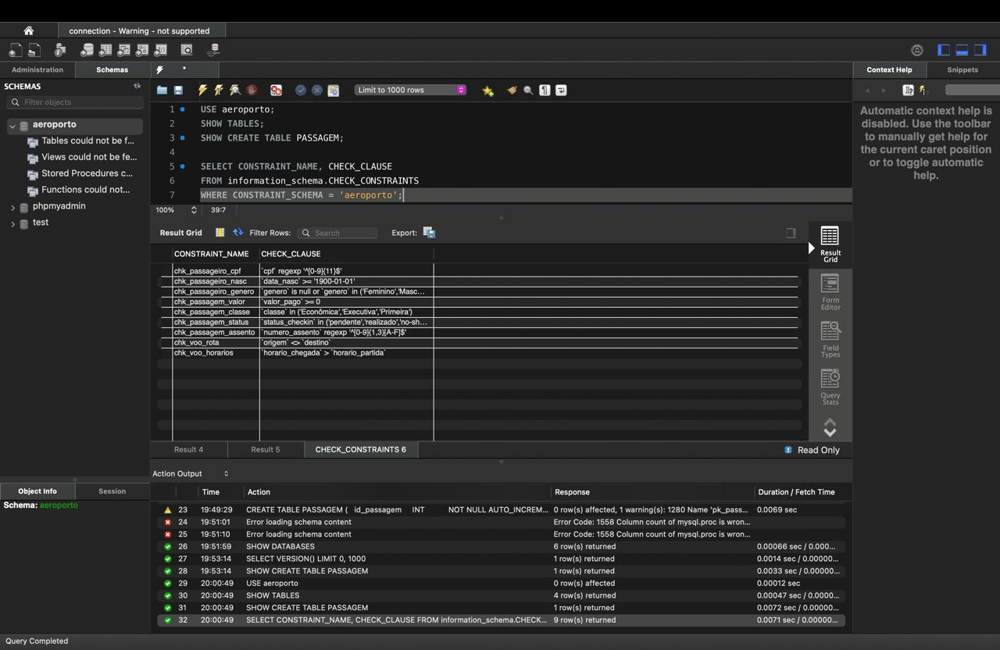
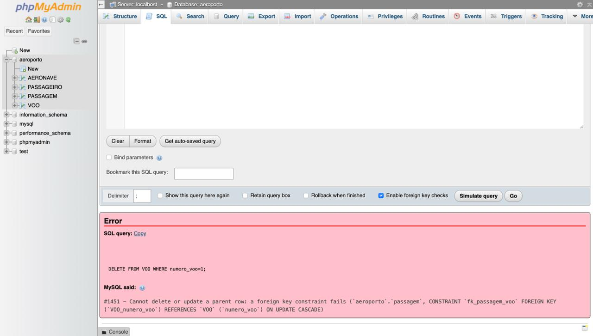
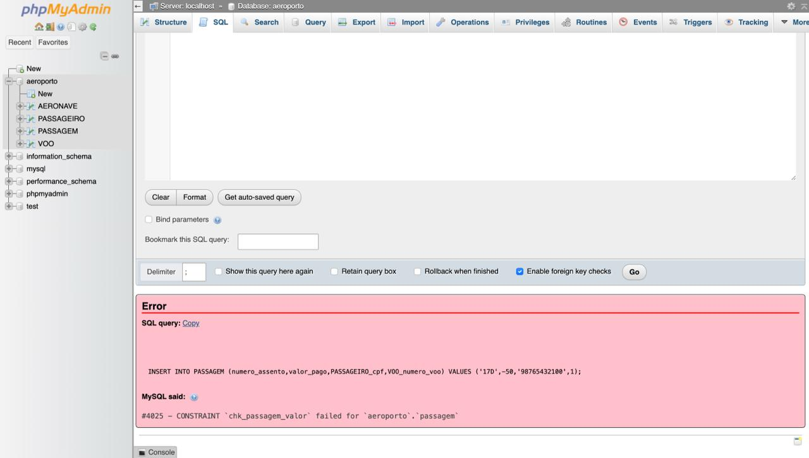
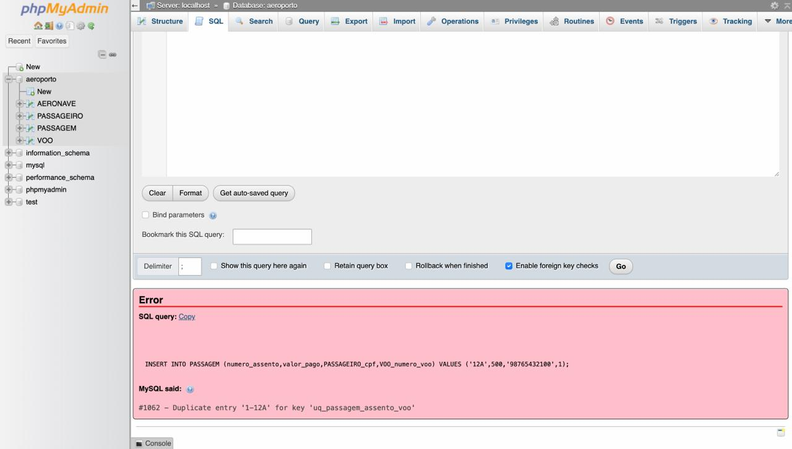
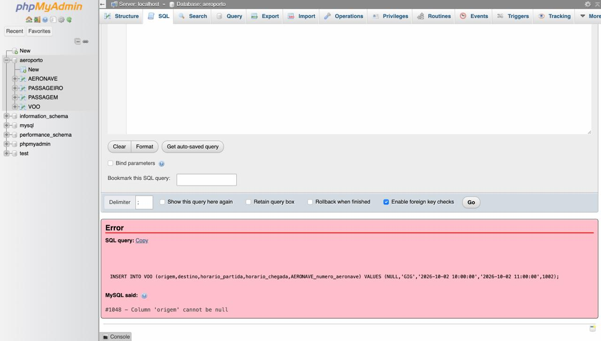
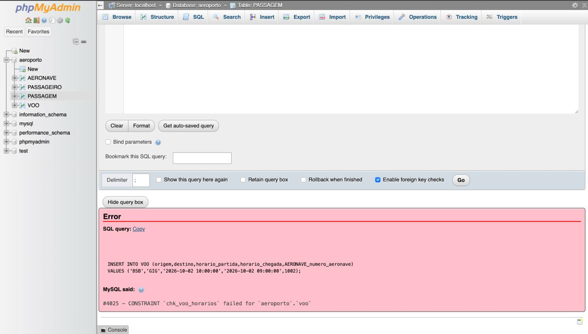
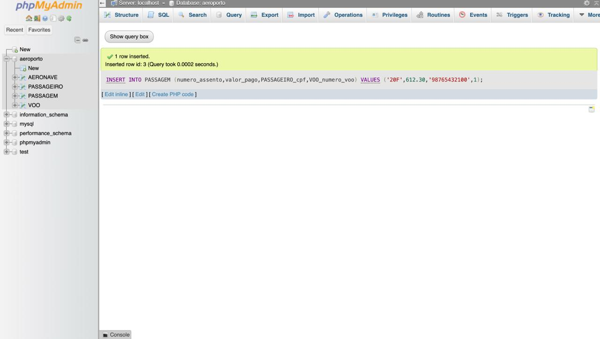
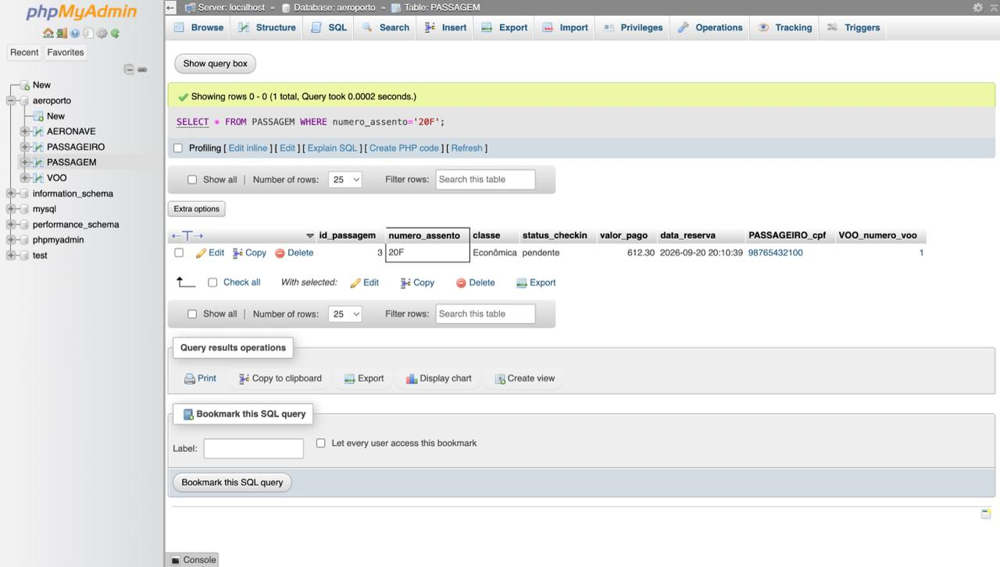

# Integridade — Projeto Aeroporto

Banco: `aeroporto`, com as tabelas `AERONAVE`, `PASSAGEIRO`, `VOO` e `PASSAGEM`.
SGBD: MariaDB (XAMPP 8.2.4).

## 1. Regras de integridade

### Integridade de entidade e de chave

Cada tabela tem uma chave primária simples: `numero_aeronave`, `cpf`, `numero_voo` e `id_passagem`. Isso impede registros sem identificação ou duplicados.

### Integridade referencial

| Chave estrangeira | Referencia | ON DELETE | ON UPDATE |
|---|---|---|---|
| `VOO.AERONAVE_numero_aeronave` | `AERONAVE` | RESTRICT | CASCADE |
| `PASSAGEM.PASSAGEIRO_cpf` | `PASSAGEIRO` | RESTRICT | CASCADE |
| `PASSAGEM.VOO_numero_voo` | `VOO` | RESTRICT | CASCADE |

- **Problema evitado:** passagem para voo ou passageiro inexistente, e voo com aeronave inexistente.
- **RESTRICT:** não deixa apagar um voo, passageiro ou aeronave que ainda tenha registros ligados a ele, o que faria o sistema perder o histórico de passagens vendidas.
- **CASCADE no UPDATE:** se uma chave for alterada, as tabelas filhas acompanham a mudança.

### Integridade de domínio

| Coluna | Restrição | Problema evitado |
|---|---|---|
| `cpf` | `CHAR(11)` + `CHECK` de 11 dígitos numéricos | CPF com letras, pontuação ou tamanho errado |
| `data_nasc` | `DATE` + `CHECK (data_nasc >= '1900-01-01')` | Data inválida |
| `genero` | `CHECK` com valores permitidos | Mesmo valor escrito de formas diferentes |
| `valor_pago` | `DECIMAL(10,2)` + `CHECK (valor_pago >= 0)` | Valor negativo ou gravado como texto |
| `classe` | `CHECK` (Econômica, Executiva, Primeira) | Classe que não existe |
| `status_checkin` | `CHECK` (pendente, realizado, no-show, cancelado) | Status fora do fluxo de check-in |
| `numero_assento` | `CHECK` no formato fileira + letra (ex.: 12A) | Assento inválido |
| `horario_partida`, `horario_chegada` | `DATETIME` | Horário gravado como texto |


### Unicidade

- `UNIQUE (VOO_numero_voo, numero_assento)`: impede vender o mesmo assento duas vezes no mesmo voo.
- `UNIQUE (VOO_numero_voo, PASSAGEIRO_cpf)`: impede que o mesmo passageiro tenha duas passagens no mesmo voo.

### Obrigatoriedade

- **`NOT NULL`:** em todos os campos essenciais (nome, datas, origem, destino, horários, assento, classe, status, valor e chaves estrangeiras).
- **Campos opcionais:** `fabricante`, `modelo` e `genero` ficaram opcionais, porque são dados complementares e exigi-los bloquearia cadastros válidos.

### Valores padrão

- **`status_checkin`:** `DEFAULT 'pendente'`, porque toda passagem começa sem check-in.
- **`data_reserva`:** `DEFAULT CURRENT_TIMESTAMP`, porque a data da reserva é o momento do cadastro.
- **`classe`:** `DEFAULT 'Econômica'`.


## 2. Regras de negócio

| Regra | Implementação |
|---|---|
| O voo não pode chegar antes de partir | `CHECK (horario_chegada > horario_partida)` |
| Origem e destino devem ser diferentes | `CHECK (origem <> destino)` |
| Um assento só pode ser vendido uma vez por voo | `UNIQUE (VOO_numero_voo, numero_assento)` |
| Um passageiro não pode ter duas passagens no mesmo voo | `UNIQUE (VOO_numero_voo, PASSAGEIRO_cpf)` |
| Uma passagem não pode ter valor negativo | `CHECK (valor_pago >= 0)` |
| Um voo com passagens vendidas não pode ser excluído | `FOREIGN KEY ... ON DELETE RESTRICT` |

Restrições `CHECK` criadas no banco:




## 3. Testes

Dados usados nos testes:

```sql
INSERT INTO AERONAVE VALUES (1001,'Embraer','E195'),(1002,'Airbus','A320');
INSERT INTO PASSAGEIRO (cpf,nome_completo,data_nasc,genero) VALUES
 ('12345678901','Ana Souza','1995-04-10','Feminino'),
 ('98765432100','Bruno Lima','1988-11-02','Masculino');
INSERT INTO VOO (origem,destino,horario_partida,horario_chegada,AERONAVE_numero_aeronave)
VALUES ('BSB','GRU','2026-10-01 08:00:00','2026-10-01 09:40:00',1001);
INSERT INTO PASSAGEM (numero_assento,classe,valor_pago,PASSAGEIRO_cpf,VOO_numero_voo)
VALUES ('12A','Econômica',489.90,'12345678901',1);
```

| # | Situação testada | Resultado esperado | Resultado obtido |
|---|---|---|---|
| 1 | Passageiro sem CPF | Bloquear | `#1048 - Column 'cpf' cannot be null` |
| 2 | Aeronave com número repetido | Bloquear | `#1062 - Duplicate entry '1001' for key 'PRIMARY'` |
| 3 | Passagem para voo inexistente | Bloquear | `#1452 - a foreign key constraint fails (fk_passagem_voo)` |
| 4 | Excluir voo com passagem vendida | Bloquear | `#1451 - Cannot delete or update a parent row` |
| 5 | Classe inexistente | Bloquear | `#4025 - CONSTRAINT chk_passagem_classe failed` |
| 6 | Valor negativo | Bloquear | `#4025 - CONSTRAINT chk_passagem_valor failed` |
| 7 | Mesmo assento duas vezes no voo | Bloquear | `#1062 - Duplicate entry '1-12A' for key 'uq_passagem_assento_voo'` |
| 8 | Mesmo passageiro duas vezes no voo | Bloquear | `#1062 - Duplicate entry for key 'uq_passagem_passageiro_voo'` |
| 9 | Voo sem origem | Bloquear | `#1048 - Column 'origem' cannot be null` |
| 10 | Chegada antes da partida | Bloquear | `#4025 - CONSTRAINT chk_voo_horarios failed` |
| 11 | Origem igual ao destino | Bloquear | `#4025 - CONSTRAINT chk_voo_rota failed` |
| 12 | Passagem sem informar classe, status e data | Inserir com os valores padrão | Inserida com `Econômica`, `pendente` e a data atual |

Comandos utilizados:

```sql
-- 1
INSERT INTO PASSAGEIRO (cpf,nome_completo,data_nasc) VALUES (NULL,'Sem CPF','1990-01-01');
-- 2
INSERT INTO AERONAVE VALUES (1001,'Boeing','737');
-- 3
INSERT INTO PASSAGEM (numero_assento,valor_pago,PASSAGEIRO_cpf,VOO_numero_voo) VALUES ('15B',300,'12345678901',9999);
-- 4
DELETE FROM VOO WHERE numero_voo=1;
-- 5
INSERT INTO PASSAGEM (numero_assento,classe,valor_pago,PASSAGEIRO_cpf,VOO_numero_voo) VALUES ('16C','VIP',300,'98765432100',1);
-- 6
INSERT INTO PASSAGEM (numero_assento,valor_pago,PASSAGEIRO_cpf,VOO_numero_voo) VALUES ('17D',-50,'98765432100',1);
-- 7
INSERT INTO PASSAGEM (numero_assento,valor_pago,PASSAGEIRO_cpf,VOO_numero_voo) VALUES ('12A',500,'98765432100',1);
-- 8
INSERT INTO PASSAGEM (numero_assento,valor_pago,PASSAGEIRO_cpf,VOO_numero_voo) VALUES ('18E',500,'12345678901',1);
-- 9
INSERT INTO VOO (origem,destino,horario_partida,horario_chegada,AERONAVE_numero_aeronave) VALUES (NULL,'GIG','2026-10-02 10:00:00','2026-10-02 11:00:00',1002);
-- 10
INSERT INTO VOO (origem,destino,horario_partida,horario_chegada,AERONAVE_numero_aeronave) VALUES ('BSB','GIG','2026-10-02 10:00:00','2026-10-02 09:00:00',1002);
-- 11
INSERT INTO VOO (origem,destino,horario_partida,horario_chegada,AERONAVE_numero_aeronave) VALUES ('BSB','BSB','2026-10-02 10:00:00','2026-10-02 12:00:00',1002);
-- 12
INSERT INTO PASSAGEM (numero_assento,valor_pago,PASSAGEIRO_cpf,VOO_numero_voo) VALUES ('20F',612.30,'98765432100',1);
SELECT * FROM PASSAGEM WHERE numero_assento='20F';
```

### Evidências

**Teste 4 — exclusão bloqueada pela chave estrangeira**


**Teste 6 — valor negativo bloqueado pelo CHECK**


**Teste 7 — assento repetido bloqueado pelo UNIQUE**


**Teste 9 — campo obrigatório bloqueado pelo NOT NULL**


**Teste 10 — chegada antes da partida bloqueada pelo CHECK**


**Teste 12 — inserção válida com valores padrão**




## 4. Conclusão

Todos os testes tiveram o resultado esperado. O banco bloqueou dados inconsistentes e continuou aceitando operações válidas, como mostra o teste 12.
