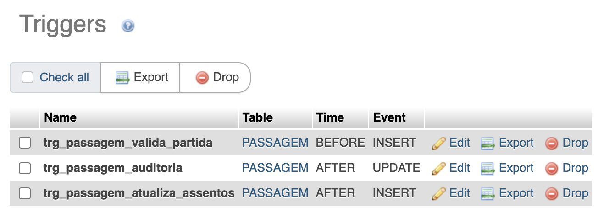
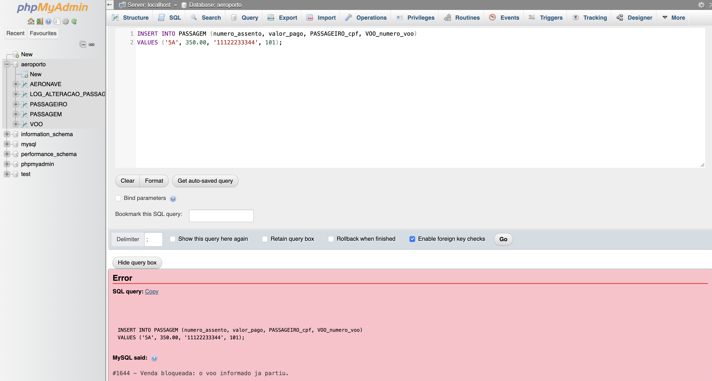
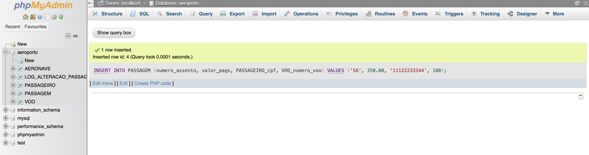
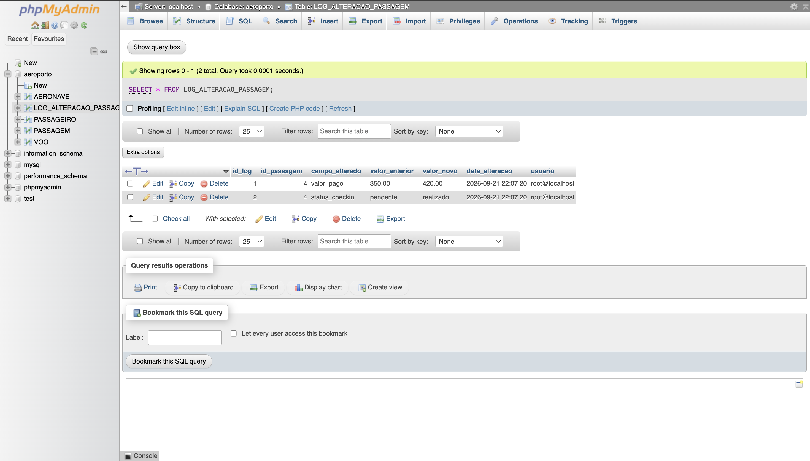
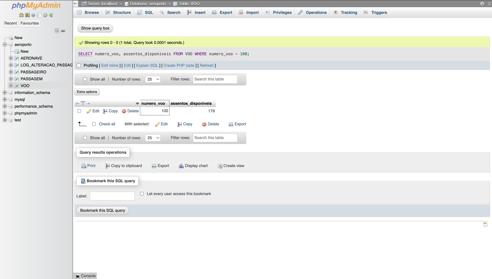
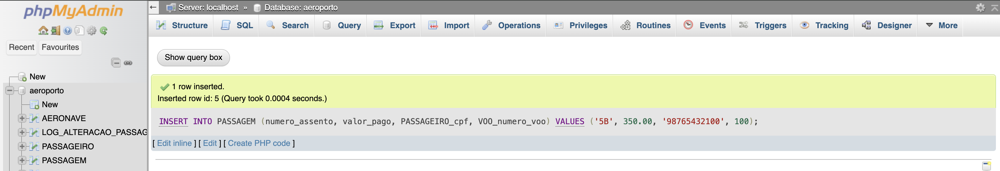
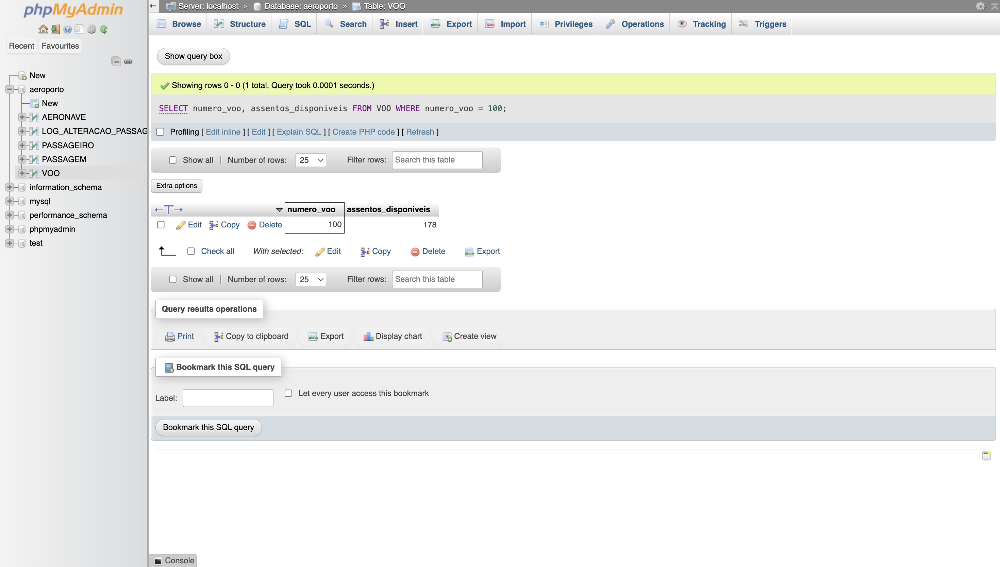

# Triggers — Projeto Aeroporto

Ajustes feitos no modelo para a atividade:
- **`VOO.assentos_disponiveis`:** coluna nova com o saldo de assentos livres (padrão 180), usada no Desafio 3.
- **`LOG_ALTERACAO_PASSAGEM`:** tabela nova de auditoria, usada no Desafio 2.



---

## Desafio 1 — Validação (`BEFORE INSERT`)

**Trigger:** `trg_passagem_valida_partida`, na tabela `PASSAGEM`.

**Regra:** não é possível vender passagem para um voo que já partiu. O trigger busca o `horario_partida` do voo informado em `NEW.VOO_numero_voo` e, se ele já passou, cancela o `INSERT` com `SIGNAL SQLSTATE '45000'`.

Essa regra não podia ser feita com `CHECK`, porque o `CHECK` não aceita `NOW()` (limitação registrada na atividade 10).

| Teste | Comando | Esperado | Obtido |
|---|---|---|---|
| Voo que já partiu (101) | `INSERT INTO PASSAGEM (numero_assento, valor_pago, PASSAGEIRO_cpf, VOO_numero_voo) VALUES ('5A', 350.00, '11122233344', 101);` | Bloquear | `#1644 - Venda bloqueada: o voo informado ja partiu.` |
| Voo futuro (100) | `INSERT INTO PASSAGEM (numero_assento, valor_pago, PASSAGEIRO_cpf, VOO_numero_voo) VALUES ('5A', 350.00, '11122233344', 100);` | Inserir | 1 linha inserida |




---

## Desafio 2 — Auditoria (`AFTER UPDATE`)

**Trigger:** `trg_passagem_auditoria`, na tabela `PASSAGEM`.

**Regra:** toda alteração em `valor_pago` (tarifa) ou `status_checkin` é registrada na tabela `LOG_ALTERACAO_PASSAGEM`. O trigger compara `OLD` e `NEW` e grava o valor antigo, o novo, a data/hora e o usuário (`CURRENT_USER()`).

Tabela de auditoria:

| Coluna | Descrição |
|---|---|
| `id_log` | Chave primária do log |
| `id_passagem` | Passagem alterada |
| `campo_alterado` | `valor_pago` ou `status_checkin` |
| `valor_anterior` / `valor_novo` | Valores de `OLD` e `NEW` |
| `data_alteracao` | Data/hora da alteração |
| `usuario` | Usuário do banco |

**Teste:**

```sql
UPDATE PASSAGEM
SET valor_pago = 420.00, status_checkin = 'realizado'
WHERE numero_assento = '5A' AND VOO_numero_voo = 100;

SELECT * FROM LOG_ALTERACAO_PASSAGEM;
```

**Resultado:** duas linhas registradas, `valor_pago` de 350.00 para 420.00 e `status_checkin` de `pendente` para `realizado`, ambas com data/hora e usuário `root@localhost`.



---

## Desafio 3 — Sincronização (`AFTER INSERT`)

**Trigger:** `trg_passagem_atualiza_assentos`, na tabela `PASSAGEM`.

**Regra:** ao emitir uma passagem, o saldo `assentos_disponiveis` do voo diminui em 1. O voo é encontrado pela chave estrangeira `NEW.VOO_numero_voo`.

**Teste:**

```sql
SELECT numero_voo, assentos_disponiveis FROM VOO WHERE numero_voo = 100;  -- antes

INSERT INTO PASSAGEM (numero_assento, valor_pago, PASSAGEIRO_cpf, VOO_numero_voo)
VALUES ('5B', 350.00, '98765432100', 100);

SELECT numero_voo, assentos_disponiveis FROM VOO WHERE numero_voo = 100;  -- depois
```

**Resultado:** o saldo do voo 100 passou de 179 para 178 sem nenhum `UPDATE` manual.





---

## Conclusão

Os três triggers funcionaram como esperado: o de validação bloqueou a operação inválida e aceitou a válida, o de auditoria registrou os valores antigos e novos, e o de sincronização atualizou o saldo de assentos automaticamente.
